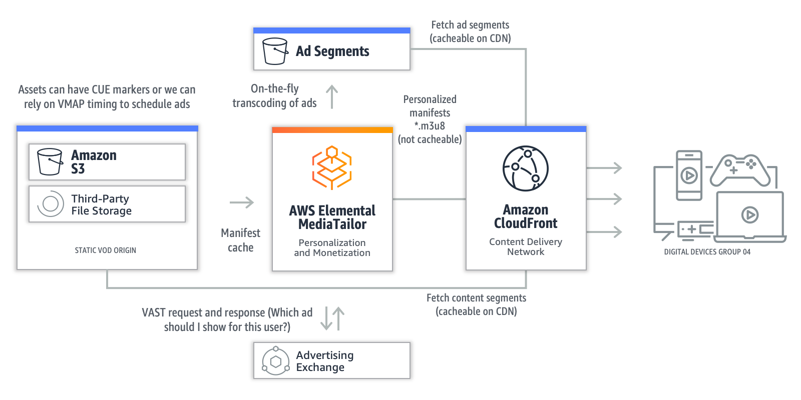
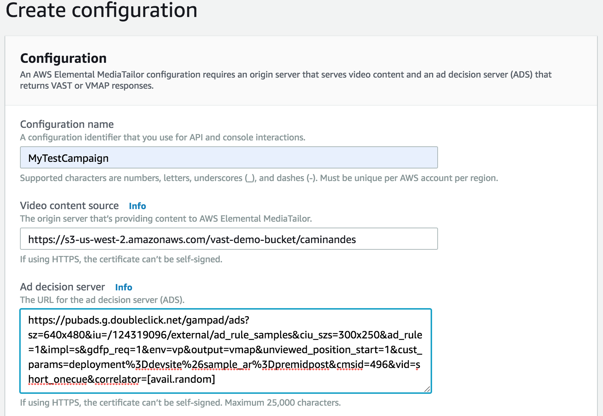

# VOD MediaTailor

After you have transcoded video assets into HLS with AWS Elemental MediaConvert, one thing you might want to do is monetize your content. The AWS Elemental MediaTailor service helps you achieve just that. You may learn more about the service [here](https://aws.amazon.com/mediatailor/).

This short workshop will take you through creating an AWS Elemental MediaTailor configuration using a media asset from a storage like AWS Elemental MediaStore, and Ad Decision Server (ADS) that returns a VMAP response. VMAP is one of the ad serving protocols that AWS Elemental MediaTailor supports and lends itself well to VOD workflows. The VMAP protocol defines the ad breaks and their timings, and can be used with assets with no ad markers, which is what we will be using here.

Below is a diagram showing how the media asset interacts with AWS Elemental MediaTailor.
	

## Prerequisites
This lab assumes that you have the following:
1. An HLS media asset either in Amazon S3 or AWS Elemental MediaStore. The asset need not have any ad markers. In this tutorial, we will use [this asset](https://kgvcvxg57iigbp.data.mediastore.us-west-2.amazonaws.com/hls/caminandes_short/master.m3u8) stored in AWS Elemental MediaStore.
1. An Ad Decision Server (ADS), or you may use a static VAST response XML hosted on a server. Here, we will use a sample VMAP response hosted and publicly made available by Google's DoubleClick for Publishers and can be found [here](https://pubads.g.doubleclick.net/gampad/ads?sz=640x480&iu=/124319096/external/ad_rule_samples&ciu_szs=300x250&ad_rule=1&impl=s&gdfp_req=1&env=vp&output=vmap&unviewed_position_start=1&cust_params=deployment%3Ddevsite%26sample_ar%3Dpremidpost&cmsid=496&vid=short_onecue&correlator=).

## Implementation Instructions

### 1. Create an AWS Elemental MediaTailor Configuration 

**Step-by-step instructions**

1. From the AWS Management Console, choose **Services** then select **AWS Elemental MediaTailor**. Make sure you're in **us-east-1** region.

1. Click on **Create configuration**.

1. Enter `MyTestCampaign` for the **Configuration  Name**.

1. For the **Video content source**, enter the MediaStore URL link to the asset Endpoint URL (https://kgvcvxg57iigbp.data.mediastore.us-west-2.amazonaws.com/hls/caminandes_short/master.m3u8) but  **_without the manifest filename_**. That is, **omit** master.m3u8.

1. Enter `https://pubads.g.doubleclick.net/gampad/ads?sz=640x480&iu=/124319096/external/ad_rule_samples&ciu_szs=300x250&ad_rule=1&impl=s&gdfp_req=1&env=vp&output=vmap&unviewed_position_start=1&cust_params=deployment%3Ddevsite%26sample_ar%3Dpremidpost&cmsid=496&vid=short_onecue&correlator=` for the **Ad decision server**. 

	

1. Click **Create Configuration**. Click on the **Configurations** link to see the configuration you just created. Click on **MyTestCampaign** to see the **Playback endpoints** populated with playback URLs. Note down the **HLS playback prefix** as you'll need it in the next section.

### 2. Test MediaTailor Playback 

1. To verify that ads are making it into your video, you may use a standalone video player to view the HLS playback endpoint such as QuickTime, VLC or any workstation-based player that supports HLS. Alternatively, you may use one of the following web-based players to stream your video: 

	* http://videojs.github.io/videojs-contrib-hls/
	* https://developer.jwplayer.com/tools/stream-tester/

1. Your full playback URL will be the **HLS playback prefix** (eg. _https://f445cfa805184f3e8d86dc2ac1137efa.mediatailor.us-east-1.amazonaws.com/v1/master/cf6421621b389b384c1fd22e51603ee95db76ae0/MyTestCampaign/_)
concatenated with the **manifest filename of the asset in MediaStore** (eg. _master.m3u8_) 

	Provide the full playback URL to the player of your choice (eg.   _https://f445cfa805184f3e8d86dc2ac1137efa.mediatailor.us-east-1.amazonaws.com/v1/master/cf6421621b389b384c1fd22e51603ee95db76ae0/MyTestCampaign/master.m3u8_)

1. With the VMAP response used here, you should see a 10-second preroll ad right at the beginning. Then, 15 seconds into the video, you should see a 10-second midroll ad. And finally, a 10-second postroll ad at the end. Note that it can take a few minutes for the ads to get transcoded and then properly stitched into the HLS manifest generated by AWS Elemental MediaTailor. This means that you may not see all the ads right away when you first play the asset back.

## Completion
Congratulations! You've successfully integrated your HLS video asset with AWS Elemental MediaTailor.

Return to the [main](../README.md) page.

## Cloud Resource Clean Up

### AWS Elemental MediaTailor
Select the configuration you created and hit the **Delete** button to clean up your resources.
