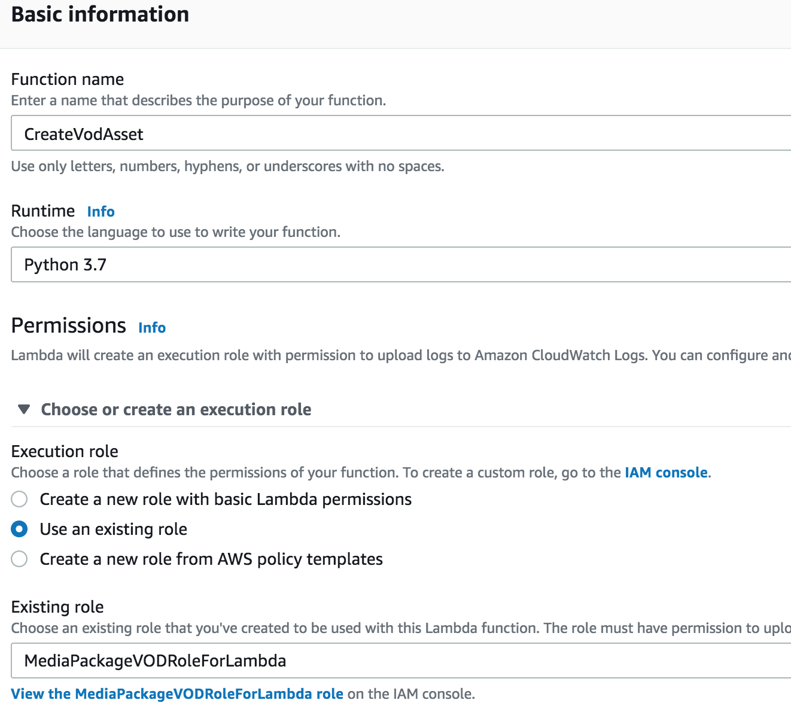
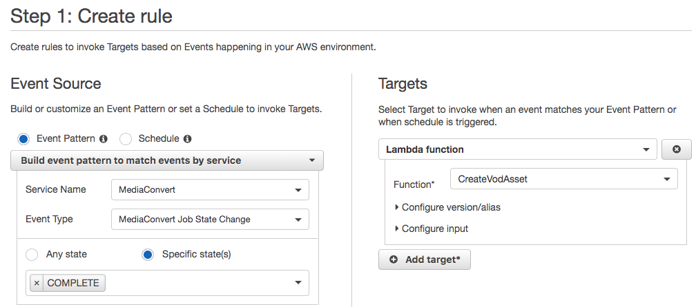
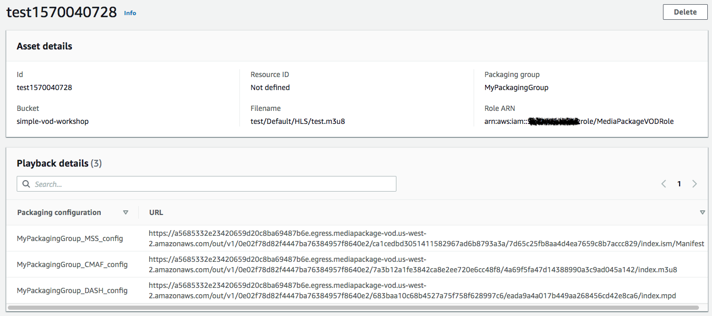

# Delivering VOD Content from AWS Elemental MediaPackage
AWS Elemental MediaPackage can now package, encrypt, and originate on-demand video. This means you can package file-based video to multiple distribution formats without having to transcode video again. A video asset can be ingested into a MediaPackage VOD pacakaging group, and made available for playback on a variety of devices. The MediaPackage VOD workflow lends itself well as a MediaConvert job post-process for jobs that output HLS. 

In this tutorial, we walk you through ingesting an HLS asset you have transcoded through MediaConvert for further packaging in a more automated fashion. You will do this by first subscribing to the MediaConvert job completion event notification through CloudWatch. You then use a Lambda to process that CloudWatch event notification and create a MediaPackage VOD asset based on the HLS output of the MediaConvert job.

If you'd like to see how you would ingest an HLS asset through the MediaPackage console without the use of Lambdas, then follow [this other tutorial](README-tutorial.md).

## Assumptions and Prerequisites
* Completion of [MediaConvert Jobs](../2-MediaConvertJobs/README.md) or [MediaConvert Jobs via WatchFolder](../7-MediaConvertJobLambda/README.md).

## Implementation Instructions

### Give MediaPackage access to S3 <a name="mediapackage-access-s3"></a>
You want to give MediaPackage access to the S3 bucket MediaConvert has been using to write outputs.

1. Follow the instructions here https://docs.aws.amazon.com/mediapackage/latest/ug/setting-up-create-trust-rel.html.  
1. Note the **MediaPackage role ARN** you created. This will be the **Source Role ARN** you will provide in your Lambda function later.

### Create a Lambda Execution Role 
The Lambda you're going to be creating will need specific permissions in order to be able to create the MediaPackage Packaging Group and VOD Asset. 

1. Navigate to the IAM console.
1. Click on **Policies** on the left hand side menu. 
1. Click on **Create Policy**.
1. Click on the **JSON** tab.
1. Replace the policy with the following:

    ```JSON
    {
        "Version": "2012-10-17",
        "Statement": [
            {
                "Sid": "EMPVOD",
                "Effect": "Allow",
                "Action": [
                    "mediapackage-vod:*"
                ],
                "Resource": "*"
            },
            {
                "Sid": "PassRole",
                "Effect": "Allow",
                "Action": "iam:PassRole",
                "Resource": "*"
            }
        ]
    }
    ```
1. Click on **Review Policy**.
1. Give the policy a name like `MediaPackageVODPolicy`.
1. Click on **Create Policy**.
1. Back on the IAM console, click on **Roles** on the left hand side menu.
1. Click on **Create Role**.
1. Under **Select service that will use this role**, select **Lambda**.
1. Click on **Next:Permissions**.
1. On the Search textbox, enter the name of the Policy you created earlier (eg. `MediaPackageVODPolicy`).
1. Click on the checkbox next to the Policy to select it.
1. Click on **Next:Tags**.
1. Click on **Next:Review**.
1. Give the Role a name like `MediaPackageVODRoleForLambda`.
1. Click on **Create Role**.


### Create the MediaPackage VOD Asset Lambda
Now that the IAM Role for the Lambda has been created, it's time to create the function. This function will create a Packaging Group, with 3 configurations: one for Microsoft Smooth, one for CMAF, and one for DASH.

1. Navigate to the AWS Lambda console.
1. Click on **Create Function**.
1. Provide a **Function Name** like `CreateVodAsset`.
1. From the **Runtime** dropdown, select `Python 3.7`.
1. Expand the **Choose or create an execution role** section. 
1. Select **Use an existing role.**.
1. From the **Existing role** dropdown, select the Role you created earlier (eg. `MediaPackageVODRoleForLambda`).

    
1. Click on **Create Function**.
1. Scroll down to the **Function Code** section. 
1. Copy the code in the [ingest_asset Lambda provided here](ingest_asset.py) and paste the content on to the lambda_function window, replacing the sample code that's in there.
1. Scroll down to the **Environment variables** section. 
1. Add two environment variables:
    * PACKAGING_GROUP_ID - choose a packaging name like `MyPackagingGroup`
    * SOURCE_ROLE_ARN - this is the MediaPackage Role ARN you created in [this section](#mediapackage-access-s3).

    
1. Scroll down to **Basic settings** section.
1. Set **Timeout** to a `1 min`.
1. Click on the **Save** button at the top to save the Lambda.

### Create an Event Rule in CloudWatch
You will now create a notification rule that matches MediaConvert COMPLETE event. The target of the rule is the Lambda you just created. 

1. Open the CloudWatch console page and select the **Rules** link on the side-bar menu under Events.
1. Click on the **Create rule** button.
1. Under **Service Name**  in the **Event Source** section, search for `MediaConvert`.
1. For **Event Type**, select `MediaConvert Job State Change`.
1. Select **Specific state(s)**,
1. From the dropdown, select `COMPLETE`.
1. In the **Targets** section, click on **Add Target**. This will default to **Lambda function**.
1. In the function dropdown, select the Lambda you just created (eg. `CreateVodAsset`).

    
1. Click on **Configure details**.
1. Give the Rule definition a name like `MediaPackageCreateAsset`.


### Run a MediaConvert Job with HLS Output
To trigger the event rule you just created in CloudWatch, and therefore the Lambda that will create the MediaPackage VOD asset, you need to create and run a job with an HLS output. You can do this by either:

* Duplicating and running one of the jobs you created in [MediaConvert Jobs](). 

    or

*  Uploading a test file to your watchfolder as you did in [MediaConvert Job Lambda]() to trigger a job creation.


### Verify the MediaPackage VOD Asset Creation
Once the MediaConvert job has completed, it is time to check and see if the corresponding MediaPackage VOD asset got created by your Lambda.

1. From the MediaPackage console, expand the **Video on Demand** menu on the left hand side navigation. 
1. Click on **Assets**.
1. You should see an asset with a name like the filename of your HLS output, appended with a timestamp. 
    
    


### Playback the MediaPackage Endpoints
To make sure that the assets are actually working, play back the various endpoints that got generated using a demo player. There should be 3 endpoints, corresponding to the 3 configurations in the Packaging Group that the Lambda created for you.

1. Back on the Assets page on the MediaPackage console, select the Asset that got created.
1. You should find the endpoints created by MediaPackage under **Playback details**. 

    

1. Copy the first playback URL. 
1. Navigate to `https://rodeolabz-us-west-2.s3-us-west-2.amazonaws.com/reinvent2019/player.html`
1. Paste the URL you copied on to the Custom URL textbox and hit the Preview button.
1. Preview the rest of the endpoints. 

    