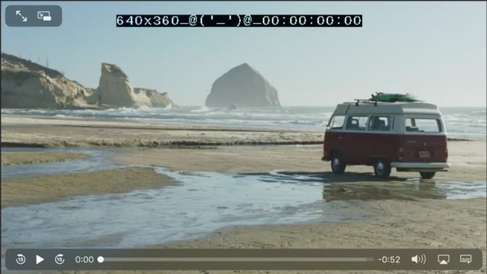
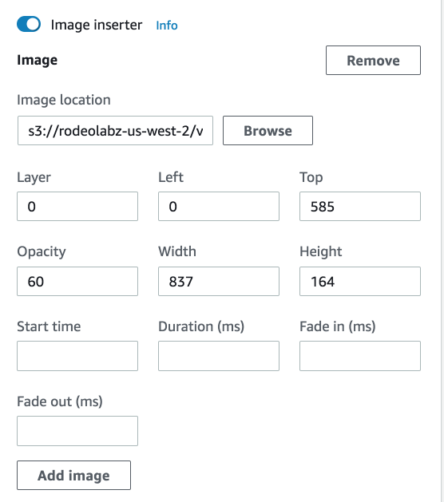
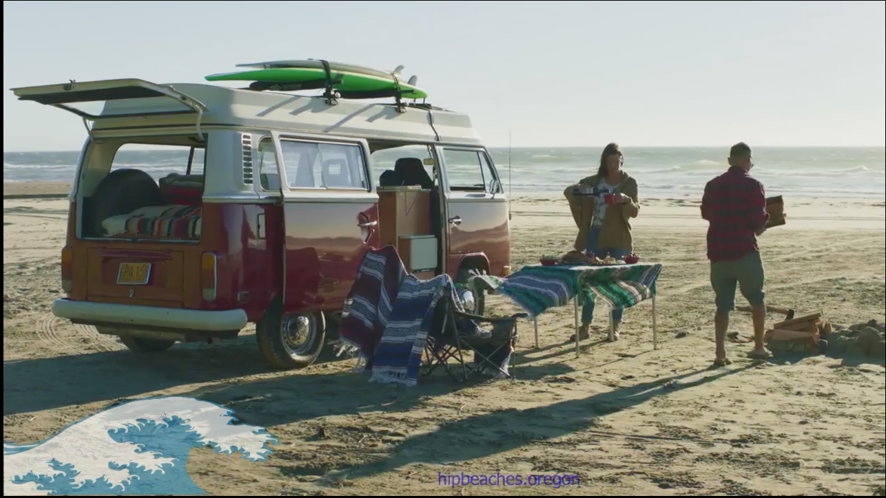

# Module 4: Modifying AWS Elemental MediaConvert Outputs

In this section we will introduce two examples of how video outputs can be modified by MediaConvert as part of the encoding and packaging workflow.

You will modify the HLS output by burning in timecodes and a label with the resolution of each quality level of the ABR stack.  Timecode burn in is often used in the video editing process to make accurate notations referencing parts of a video.

You will modify the MP4 output by inserting an image or watermark. Watermarks are often used when you want create a shareable version of your video that is difficult to be reused without your permission.  You may want to burn in copyrights or add a watermark logo that covers the entire video.  Your viewers can see a preview of the content, but the preview video is not very useful for other purposes.

The new MediaConvert job will have the following structure:

 
## Prerequisites

You need to have access to MediaConvert and S3 to complete this module. 

You need the following resources created in module 1:
* **MediaConvertRole** - the role created to give permission for MediaConvert to access resources in your account.
* **MediaBucket** - the bucket created to store outputs from MediaConvert.
* **MediaConvert job from module 2 or later** - We will start with this job and modify it in this module.  

If you used CloudFormation to configure resources, you will find the values names of MediaConvertRole and MediaBucket in the Outputs of the Stack.

## 1. Modify the HLS output to include a timecode 

You will burn in a timecode and a tag that indicates which video from the HLS output group is currently selected by the player.  

#### Duplicate the job from the previous module

1. Open the MediaConvert console for the region you are completing the lab in (US-West-Oregon). https://us-west-2.console.aws.amazon.com/mediaconvert/home?region=us-west-2#/welcome
1. Select **Jobs** from the side bar menu. 
1. Find the job you create in the previous module and click on the Job Id link to open the **Job details** page.
1. Select **Duplicate**

#### Add timecode burn in for the HLS outputs

1. Select **Output 1** from the **Apple HLS Group ** of the Output Groups section of the MediaConvert menu side bar to open the **Output settings** form for Output 1.

1. Scroll down to the **Encoding Settings** panel and select **Video 1** from the side bar.
1. Expand the **Preprocessors** carrot and change the **Timecode burn-in** switch to the on position.
1. Select **Small (16)** from the **Font size** drop down.
1. Enter `640x360_` plus your name or some other message, such as an ASCII art monkey `@('_')@`, in the **Prefix** box

    
  
1. Repeat this step for **Output 2** and **Output 3** using **Prefix** `960x540_` for **Output 2** and **Prefix** `1280x720_` for **Output 3**.

#### Create the job

1. Scroll to the bottom of the page and select **Create**
1. Wait for the job to complete.  Monitor the status of the job by refreshing the **Job detail** page.  

### 2. Play the HLS video

The HLS manifest file is located in your ouput s3 bucket in the object: s3://YOUR-MediaBucket/assets/VANLIFE/HLS/VANLIFE.m3u8

You can play the HLS using:
* Safari browser by clicking on the **link** for the object.
* **JW Player Stream Tester** - by copying the link for the object and inputing it to the player.  https://developer.jwplayer.com/tools/stream-tester/ 

#### Video preview

The HLS output should be modified with timcodes.  The MP4 and Thumbnails outputs should be unchanged.  You may notice that the resolution chosen by the player changes as the video plays over time.  This is normal, in fact, it is the _adaptive_ feature in ABR at work.  The player adapts the bitrate of the video based on sampled bandwith over time.

### 3. Add a watermark to the MP4 output

1. In the **Preprocessors** section of the Encoding settings panel for Video 1 change the **Image inserter** switch to the on position.
1. Select **Add image**
1. Enter `s3://rodeolabz-us-west-2/vodconsole/WATERMARK_wave.png` in the **Image location** box.
1. Enter `0` in the **Layer** box.
1. Enter `0` in the **Left** box.
1. Enter `518` in the **Top** box.
1. Enter `60` in the **Opacity** box.
1. Enter `837` in the **Width** box.
1. Enter `164` in the **Height** box.
1. Leave the rest of the settings empty.

    

#### Create the job

1. Scroll to the bottom of the page and select **Create**
1. Wait for the job to complete.  Monitor the status of the job by refreshing the **Job detail** page.  

### 4. Play the MP4

To play the videos, you will use the S3 HTTPS resource **Link** on the videos S3 object **Overview** page.

#### MP4s

The MP4 output is located in your ouput s3 bucket in the object: s3://YOUR-MediaBucket/assets/VANLIFE/MP4/VANLIFE.mp4

You can play the MP4 using:
* Chrome by clicking on the **Link** for the object.
* **JW Player Stream Tester** by copying the link for the object and inputing it to the player. https://developer.jwplayer.com/tools/stream-tester/ 

### Video preview

The MP4 output should be modified with a watermark.  The HLS and Thumbnails outputs should be unchanged.

## Completion

Move forward to the next module to work captions.

Next module: [**Working with Captions**](../5-Captions/README.md) 

